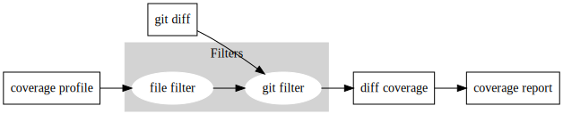

# gocover

## Overview

`gocover` is a go unit test coverage explorer and inspector, providing go module level test coverage based on `go test` coverage result, as well as diff coverage between git commits. Plus, the tool supports annotations of ignoring file/[blocks](https://go.dev/blog/cover) at coverage calculation stage.



## Installation

### Install From Release

- Download the latest [Release](https://github.com/Azure/gocover/releases) and extract it. 

### Install From Source

- Clone the repo
- Build Binary
```bash
go build .
```

## Usage

### Definition

Here is how we inspect the test coverage:

- **Total Lines:** # of total lines of your change or the entire repo/module
- **Ignored Lines:** # of the lines you ignored
- **Effictive Lines:** total lines - ignored lines
- **Covered Lines:** # of the lines covered by test
- **Coverage:** Covered Lines / Effictive Lines

### Run Coverage Check

- Run test and get `coverage.out`

```bash
go test ./... -coverprofile=coverage.out
```
- Get diff coverage

You need to commit the change to your branch before running `go test`. 

```bash
gocover diff --repository-path=${REPO ROOT PATH} --cover-profile=${PATH TO}coverage.out --compare-branch=origin/master 
```

- Get overall coverage

```bash
gocover full --repository-path=${REPO ROOT PATH} --cover-profile=${PATH TO}coverage.out
```

- Check the coverage detail at `coverage.html`

- Note: Before the coverage inspection, we will check whether a _test.go file exist within each package. 


### Run unit test and get coverage results in one command

Use following command to run the unit tests and get coverage on the module.
The cover profiles and coverage result are written in the output directory.
```bash
gocover test --repository-path=${REPO ROOT PATH} --coverage-mode [diff|full] --output /tmp
```

### Set Ignore Annotations

Use `//+gocover:ignore:file comments` or `//+gocover:ignore:block comments` as annotation, do not add any space among words, and adding non-empty comments. Note that comments does not support multiple lines.

#### Ignore files

Put `//+gocover:ignore:file comments` at any line in a file to ignore a file at coverage inspection. Note that `//+gocover:ignore:file comments` has the highest priority, it will overrides other ignoring annotation.

```go
//+gocover:ignore:file ignore this file!
package foo
func foo() {}
```

#### Ignore Block

We follow the definition of [basic block](https://go.dev/blog/cover) from `go test` to keep the same logic on coverage calculation.

- Note: The `block` is different from the [golang block](https://go.dev/ref/spec#Blocks). If you are not sure about the definition of the block, you can check the detail about every `block` within your change at the `coverage.out` file. Make sure to put the annotation into the `block`.
- Note: As we use # of lines in coverage calculation, there is a special case that a single line falling into several blocks. In this case, if any part of a line falls into an ignored block, the line will be regard as an ignored line. You can check it at function `case5` in the following examples. 

```go
package main

import "fmt"

var i, j int = 1, 2

func case1() { //+gocover:ignore:block ignore this block  -|
 var c, python, java = true, false, "no!"               // | -> Lines ignored
 fmt.Println(i, j, c, python, java)                     //-|
}

func case2(x int) {//+gocover:ignore:block ignore this block  -|
 var c, python, java = true, false, "no!"                   // | -> Lines ignored
 if x > 0 {                                                 //-|
  fmt.Println(i, j, c, python, java)
 }

 fmt.Println(i, j, c, python, java, x)
}

func case3(x int) {//+gocover:ignore:block ignore this block -|
 var c, python, java = true, false, "no!"                  // | -> Lines ingored - Block1
 if x > 0 { //+gocover:ignore:block ignore this block        -|
  fmt.Println(i, j, c, python, java)                       // | -> Lines ingored - Block2
 }                                                         //-|

 fmt.Println(i, j, c, python, java, x)
}

func case4(func() int) {
	{ //+gocover:ignore:block ignore this block      -|
		fmt.Printf("A")                        // |
		fmt.Printf("A")                        // | -> Lines ignored
		fmt.Printf("A")                        // |
	}                                              //-|
	fmt.Printf("A")
}

func case5(x int) {                                //-|
	//+gocover:ignore:block ignore this block     | 
	case6(func() int {                         //-| -> Lines ignored
		return 1
	})
}
```

## Advanced Usage

### Commands

| Command Options | Definition |
| --- | --- |
| —cover-profile | Coverage profile produced by 'go test’ |
| —repository-path | The root path of repository |
| —host-path | The host path for the go project |

- Diff Coverage

| Command Options | Definition |
| --- | --- |
| —branch-to-compare | branch to compare |
| —coverage-baseline | The tool will return an error code if coverage is less than coverage baseline(%) |
| —output | Diff coverage output file |
| —format | Format of the diff coverage report, one of: html, json, markdown |
| —excludes | Exclude files for diff coverage inspection |

## FAQ

### How to calculate diff coverage

There are mainly there steps to calculate diff coverage for a module.

1. Use `go test` to generate cover profiles for the module because `gocover` highly relies on cover profiles generated by it.
2. Generate git diff changes compared current branch with master/main branch.
3. Loop over each line from the diff changes, and reverse lookup the profile block from the [cover profile](https://pkg.go.dev/golang.org/x/tools@v0.1.10/cover) in the step 1. The `Count` field of cover profile indicates whether this code line is covered by unit test or not.

### Package Coverage Rule

1. `gocover` relies on `go cover` to generate test coverage
2. `go cover` relies on [`_test.go`](https://pkg.go.dev/cmd/go/internal/test) under a package to calculate coverage for the package (not crossing the package)
3. if we don't care about the test coverage for a package, it's fine to have no `_test.go` under the package. In this situation, package owner is responsible for the quality of this package.
4. if we want to count the package into test coverage, we should at least create one `_test.go` under the package

For example, there are two package, pkga and pkgb, and pkgb reference a function of pkga. Following is the output of the `go test`.
```
.
├── coverage.out
├── go.mod
├── pkga
│   └── a.go
└── pkgb
    ├── b.go
    └── b_test.go
```

```bash
$ go test ./... -coverprofile=coverage.out
?       gotest  [no test files]
?       gotest/pkga     [no test files]
ok      gotest/pkgb     0.002s  coverage: 0.0% of statements [no tests to run]

$ cat coverage.out
mode: set
gotest/pkgb/b.go:8.17,10.2 1 0
```

If a package needs diff coverage result, please make sure that a least one `_test.go` exists, even though its contents are emtpy. The empty `_test.go` means it's only a valid `_test.go`.

```go
package a
```
or
```go
package a

import "testing"

func TestFoo(t *testing.T) {

}
```

## Contributing

This project welcomes contributions and suggestions.  Most contributions require you to agree to a
Contributor License Agreement (CLA) declaring that you have the right to, and actually do, grant us
the rights to use your contribution. For details, visit https://cla.opensource.microsoft.com.

When you submit a pull request, a CLA bot will automatically determine whether you need to provide
a CLA and decorate the PR appropriately (e.g., status check, comment). Simply follow the instructions
provided by the bot. You will only need to do this once across all repos using our CLA.

This project has adopted the [Microsoft Open Source Code of Conduct](https://opensource.microsoft.com/codeofconduct/).
For more information see the [Code of Conduct FAQ](https://opensource.microsoft.com/codeofconduct/faq/) or
contact [opencode@microsoft.com](mailto:opencode@microsoft.com) with any additional questions or comments.

## Trademarks

This project may contain trademarks or logos for projects, products, or services. Authorized use of Microsoft 
trademarks or logos is subject to and must follow 
[Microsoft's Trademark & Brand Guidelines](https://www.microsoft.com/en-us/legal/intellectualproperty/trademarks/usage/general).
Use of Microsoft trademarks or logos in modified versions of this project must not cause confusion or imply Microsoft sponsorship.
Any use of third-party trademarks or logos are subject to those third-party's policies.
